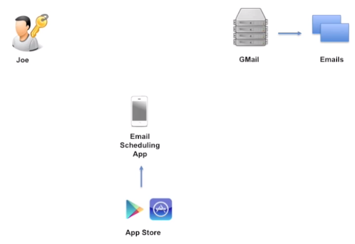
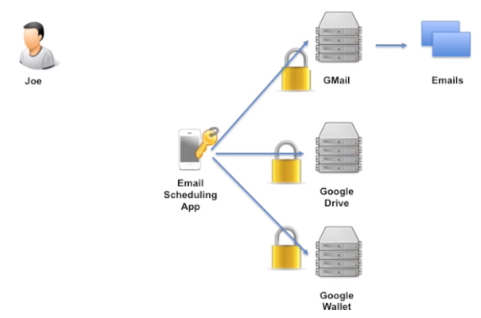
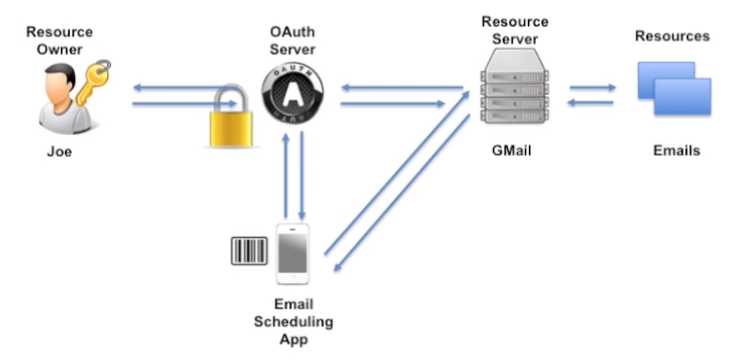
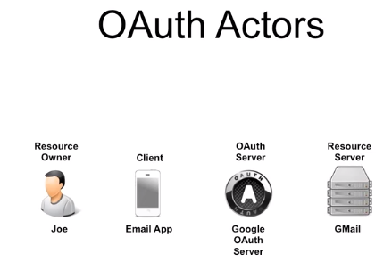
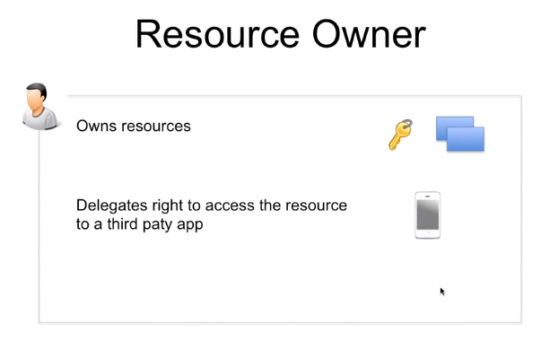
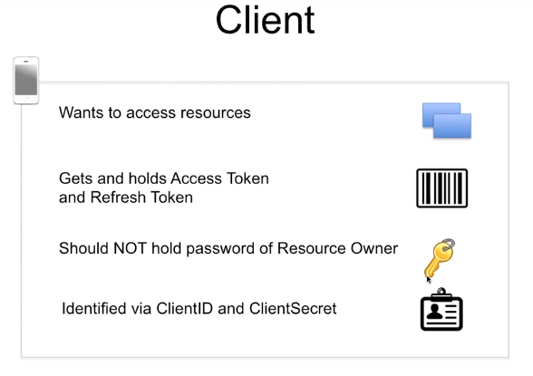
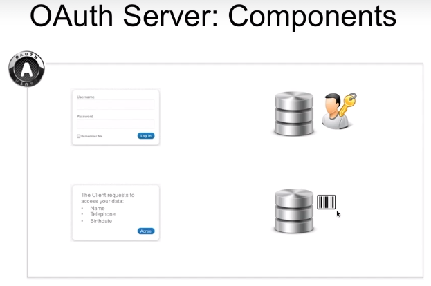
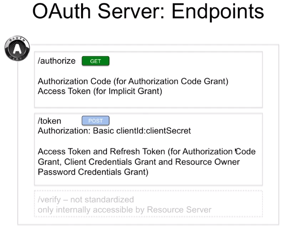
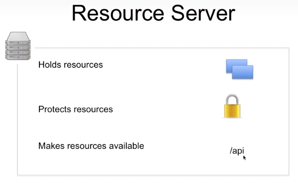

# learn-oauth
What I learned about oauth

# 3. Introduction
```
OAuth actors (with specific roles) acts in interactional flow
OAuth tokens (credentials) like keys to unlock resources stored securely
OAuth endpoints (Web services, API realized on OAuth server)
OAuth flows (4 different types: mobile app, cloud, web services)
```

# 4. Practical OAuth usage
google linkedin paypal facebook services
provide API services.(protected by OAuth)

## OAuth Worksheets
develop and leverage social services (e.g. Google, Facebook)
```
- Documentation :
    https://developers.google.com/accounts/docs/OAuth2
    https://developers.google.com/oauthplayground/
- Prerequisite : Google Account, curl
- Client Registration
- Authorization Endpoint
- Token EndPoint
- Resources Access
```

# 5. Scenario
```
Resource Owner - Resources Server(GMail) - Resources
               - mobile app(3rd party) from App Store
```

[](#5-scenario)

# 8. Password Anti-pattern
providing password (credentials) is dangerous in security perspectives

## Password Anti-pattern Examples
[](#password-anti-pattern-examples)
```
Examples of password anti-pattern
1 open mobile app -> owner Sarah credentials verification
saving credentials on mobile device : not secure (other apps can act on behalf of Sarah)

2 cloud example
twitter -> LinkedIn using twitter credentials to create news stream
```
Solve this problem with OAuth2.0 without sharing password.


# 9. Solution : OAuth 2.0
```
Resource Owner - OAuth Server - Resources Server(GMail) - Resources
               - mobile app
```
1. mobile App -> Oauth Server
2. Oauth Server ask Resource owner credentials
   Resource Owner inputs and verifies credentials to OAuth Server
2. Token (randomly created) created by OAuth server (stored in DB)-> mobile App
3. App sends token to Resources Server -> sends back to Oauth Server
4. OAuth Server checks token(check if revoked or granted)
5. Resource Server's own authorization process -> sends Resources to 3rd party app

## OAuth 2.0 Solution

[](#oauth-20-solution)
```
Delegating access to resources via http protocol : 

Provide token to the app (specific access right. it has an expiration date)
User obtains token by providing credentials(username, pw) to OAuth server (then it sends back the token)

This token is used by mobile app(3rd party) to access resources from Resource Server
(only subset of data for a limited period of time)

OAuth is used for :
Access rights are delegated to third party clients.
```

## Advantages of Oauth 2.0
- First time loggin in OAuth Server: Users are asked for list of information that will be given out.
- App access(Token) can be revoked

# 10. OAuth is Standardized by IETF
```
References to more Information on OAuth 2.0
OAuth 2 is a standard for delegating authorization for accessing resources via HTTP.

OAuth 2 is specified and standardized by the IETF in RFC6749.

http://tools.ietf.org/html/rfc6749
```

# 11. OAuth Components & Terminology

# 12. OAuth Actors
OAuth is designed for distributed systems. Consists of serveral actors with distinct roles.
[](#12-oauth-actors)

## Resource Owner
    1. direct access to resources(by using id/pw credentials)
    2. indirect access (by access token): delegates access right to client(3rd party)
        3rd party access the data in the name of the resource owner

[](#resource-owner)

## Client
    (Cloud or Mobile App) attempts to access resources(protected user data)
    gets and holds Access Token and Refresh Token
    should not hold password of Resource Owner
    identified via client id and client secret (provided by oauth server registration process)

[](#client)

## OAuth Server
    (Provider/Authorization Server)
    1. Authentication : login page(id/pw or sso), identity provider/identify access management infrastructure (DB backend)
    2. Consent Server : consent from User for delegation of access right to client
    3. Token Management Infrastructure (DB) : create/verify tokens
        access/refresh token, reg_dt, revoked_dt, valid_yn

[](#oauth-server)

### OAuth Server End Points
    /authorize GET (login & consent)
        returns : auth_code(for authorization code grant), access token(for implicit grant)
    /token POST
        authorization: basic client id: client secret
        returns : access/refresh token ( for authorization code grant, client credentials grant and resources owner pw credentials grant)
    /verify not standardized
        only internally accessible by Resource Server

[](oauth-server-end-points)

### Resource Provider
    (Web API ensures authorized users access the data)
    offeres protected data to authenticated users via http protocol(by web api)
    Asks id/pw by resources owner or Access Token(check validity)
    holds & protect resources

[](#resource-provider)
